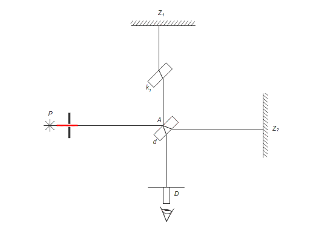

#FYZ #FYZ/relativity 
Problémy:
1) Může pozorovatel v IVS zjistit její rovnoměrný přímočarý pohyb pozorování nemechanických jevů?
2) Určení rychlosti světla.

---

- **Olaf Romer** (přítel Newtona) - z astronomických pozorování zjistil, že se světlo šíří konečnou rychlostí
- **Christian Huygens** – určil přibližnou hodnotu
- **Hippolyte Louis Fizeau** \[fizó\] 1819-1896 pozemská metoda měření rychlosti světla – (otáčející se ozubené kolo přerušovalo světelný paprsek, odraz od zrcadla cca 8 km vzdáleného, měřila se rychlost kola (315 300 km/s). Nelze však určit rychlost v různých směrech.
- **lbert Abraham Michelson** Nobelova cena 1907 - spektroskopie
	- Pokus měl zjistit absolutní pohyb Země vůči éteru
	- Paprsky dopadající na stínítko jsou koherentní, vytvářejí interferenční obrazec.
	- Otočením o 90° by se měly změnit, ale to se nestalo $\implies c=\text{konstatní}$.
	- nejužitečnější neúspěšný experiment

